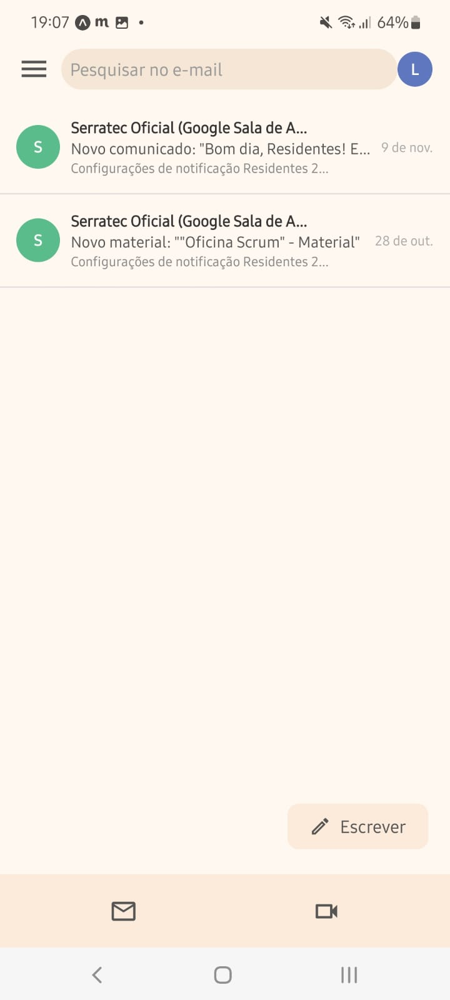
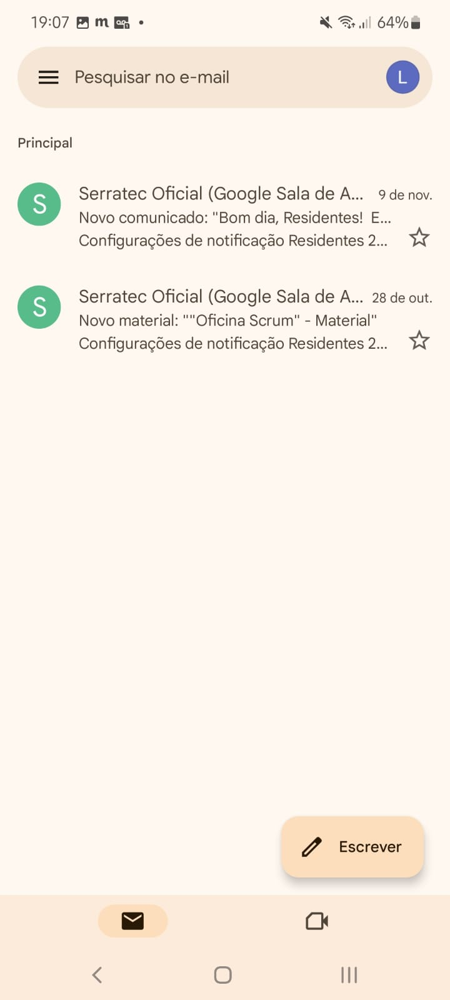
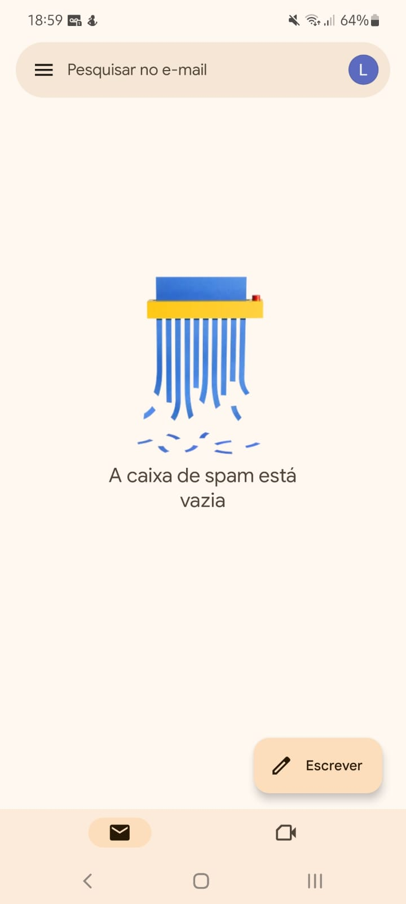

# 📬 Gmail Clone - Inbox & Spam Screens

Um projeto em React Native que replica as telas de caixa de entrada e spam do Gmail, focado em design.

## 📄 Descrição
Este projeto é um clone das telas de **caixa de entrada** e **spam** do Gmail, desenvolvido com React Native. Não é uma aplicação funcional completa para gerenciar emails, mas sim uma reprodução visual das telas.

## ✨ Funcionalidades
* Tela que exibe a lista de e-mails na **caixa de entrada**
* Tela que exibe a lista de e-mails no **spam**

## 📷 Prévia

### Caixa de Entrada

* Clone:
   
  

* Original:
  
  

### Spam
* Clone:
   
  

* Original:
   
  
